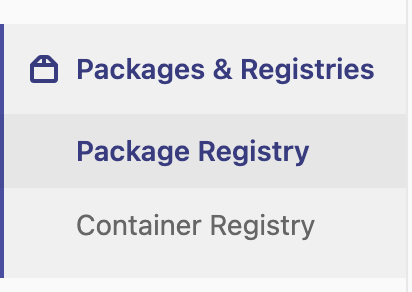
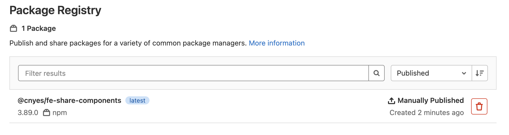

要怎麼把公司UI共用元件庫打包發佈讓所有專案能夠使用又不希望上傳到公開的元件庫？
一般下載套件如使用yarn作為套件管理工具都是到公開元件`https://registry.yarnpkg.com`做下載，但公司的東西不希望放到公開的地方，希望能夠放到自己的機器上。目前公司是自己架Gitlab，所有程式碼都推到公司機器上。

那公用套件庫要怎麼也一起推到Gitlab，並可以從Gitlab做下載呢？
Gitlab有提供Packages & Registries(圖1)。配合CICD每次發tags時能夠觸發發佈成功之後就會如圖2

|圖1|圖2|
|---|---|
|| |

 
 

* [Publish packages with Yarn | GitLab](https://docs.gitlab.com/ee/user/packages/yarn_repository/)
* [(10) GitLab NPM Registry Demo - YouTube](https://www.youtube.com/watch?v=yvLxtkvsFDA)
