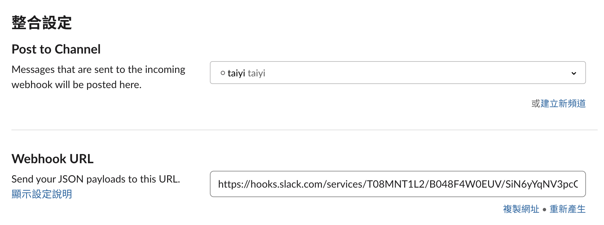
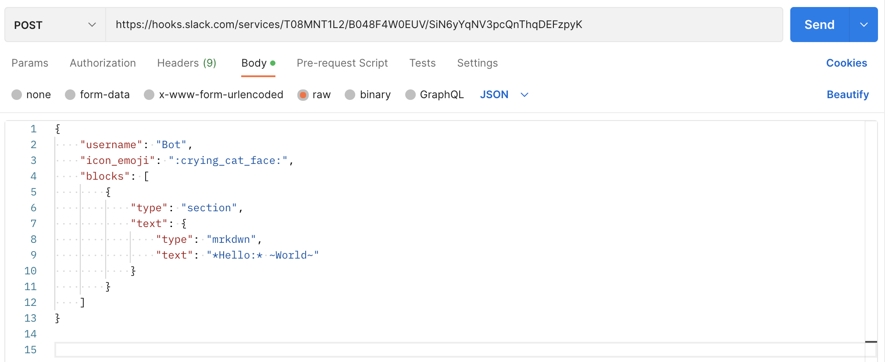
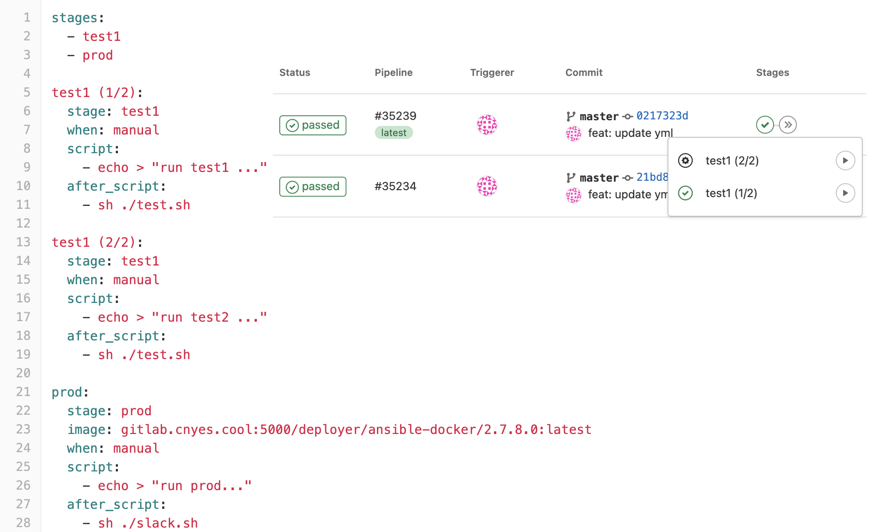

## Slack Hooks
2023/01/04

---

## 建立一組Web hook

[slack app custom integrations](https://cnyesteam.slack.com/apps/manage/custom-integrations)

管理 > 自訂整合 > 傳入的WebHook > 新增至Slack

---

* 擇要傳送訊息的群組，會得到一組Webhook URL

---

透過Postman來傳送訊息到Slack

---

---
`.gitlab-ci.yaml`

---

