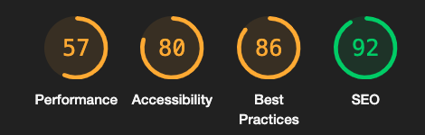
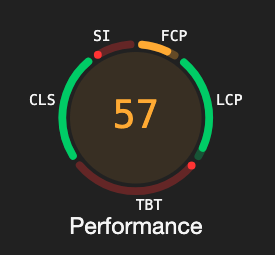
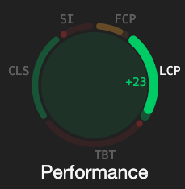
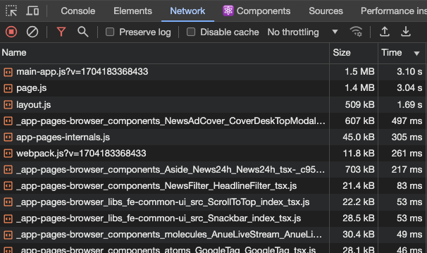
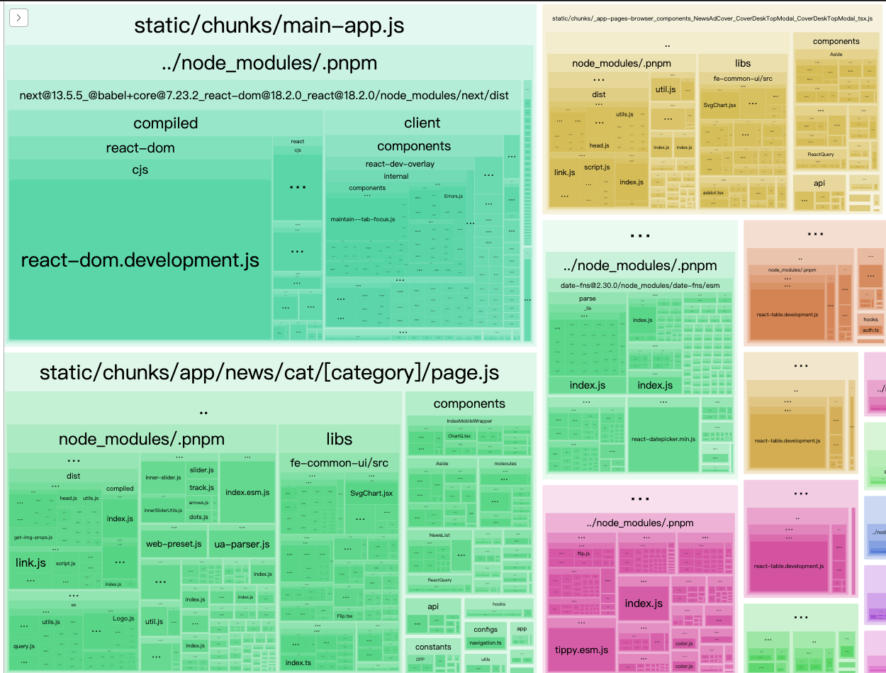
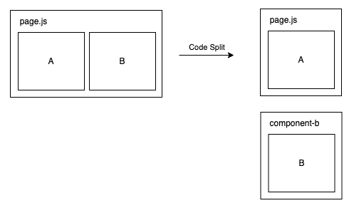

## 新聞優化

2024/01/03

---

## 比較基準

::: block
* 與舊專案比較
* 與自己前一個版本比較
	* Lighthouse(Performance/SEO)
	* 壓力測試分數
:::

---

## Lighthouse

* 使用新聞內頁作為範例
* Chrome Dev Tool → Lighthouse

---

* Performance

::: block

:::

---

|指標|說明|
|--|--|
|SI([Speed Index](https://developer.chrome.com/docs/lighthouse/performance/speed-index/?utm_source=lighthouse&utm_medium=devtools))|測量頁面載入速度|
|FCP([First Contentful Paint](https://developer.chrome.com/docs/lighthouse/performance/first-contentful-paint/?utm_source=lighthouse&utm_medium=devtools))|量測第一個文字或圖片渲染時間|
|LCP([Largest Contentful Paint](https://developer.chrome.com/docs/lighthouse/performance/lighthouse-largest-contentful-paint/?utm_source=lighthouse&utm_medium=devtools))|量測最大的文字或圖片渲染時間|
|TBT([Total Blocking Time](https://developer.chrome.com/docs/lighthouse/performance/lighthouse-total-blocking-time/?utm_source=lighthouse&utm_medium=devtools))|計算超時任務(50ms)的總和|
|CLS([Cumulative Layout Shift](https://web.dev/articles/cls?utm_source=lighthouse&utm_medium=devtools))|計算元素偏移量總和|

---

## 優化方向

* Speed Index(SI)
	* [Minimize main thread work](https://developer.chrome.com/docs/lighthouse/performance/mainthread-work-breakdown)
		* Code Split
	* [Reduce JavaScript execution time](https://developer.chrome.com/docs/lighthouse/performance/bootup-time)
		* Code Split, Minify, 移除不必要的程式碼
* First Contentful Paint(FCP)
	* 移除沒用到的CSS, 推遲載入不重要的CSS, Minify CSS
	* 使用Server-side rendering(SSR)
	* 將大任務拆分成小任務(Code Split)
* Total Blocking Time(TBT)
	* 移除非必要JS, Code Split, 減少第三方套件大小

---

## Code Split

|Network|Webpack Bundle Analyzer |
|--|--|
|||

* Network每一列是一個chunk(對應到右邊的一大塊方格)

---

## Code Split

---

## 減少不必要的載入
* [`[ANUE-8848][FE][新聞改版]DatePicker優化`](https://gitlab.cnyes.cool/anue/frontend/fe-cnyes/-/merge_requests/235)

---
## Reference
* [Optimize Largest Contentful Paint](https://web.dev/articles/optimize-lcp)
j
--- 

