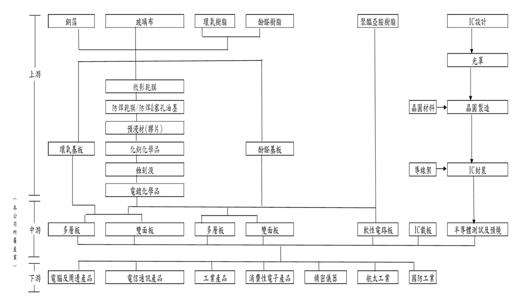
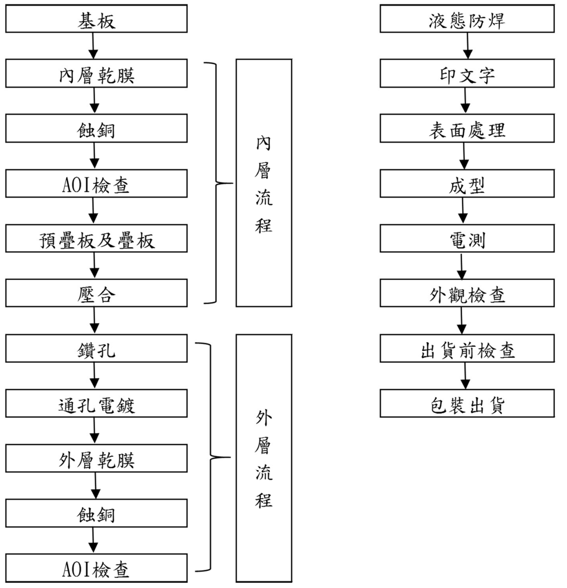

## 標籤
* ABF(Ajinomoto Build-up Film)
* PCB
* Apple/iPhone
* AMD
* PS5

董事長: 曾子章

## 轉投資/子公司
-   旭德科技（2000年1月併入欣興集團）
-   聯致科技（轉投資）
-   群浤科技（前身為欣興電子興邦廠，2023年7月1日合併）
-   柏拉圖電子（1999年11月併入）
-   聯能科技
-   群策科技（2001年10月併入）
-   同泰電子
-   鼎鑫電子（2002年3月併入）

## 生產基地
* 山鶯廠
* 中園廠
* 合江廠
* 合江二廠
* 蘆竹二廠
* 蘆竹三廠
* 楊梅廠
* 新豐廠(前身：全懋精密科技)

## 業務
* IC晶片放的板子
- 印刷電路板(PCB, Printed circuit board)
- 高密度連接板(HDI PCB, High density interconnect printed circuit board)板
- 軟板 (FPC, Flexible printed circuits)
- 軟硬複合板 (Rigid-flex PCB)
- 載板 (IC Carrier)
- IC 測試及預燒系統之開發、製造、加工與銷售
- CSP(Chip Scale Package)

* BT 載板和 HDI 合計占公司營收達 86%
* ABF 載板使用於 HPC 產品，包含 CPU、GPU、ASIC 等；BT 載板使用於智慧型手機之 AP（Application Processor，手機應用處理器）、Modem（數據機晶片）等；HDI 則用於 PC/NB、手機、車用電子等，

PCB 事業處：
1. 高階 Micro-LED PCB 製程技術
2. 高密度整合系統封裝(SiP)板製程技術
3. 5G 光模塊高速 PCB 技術
4. 車載雷達高頻 PCB 技術
5. 通訊、雲端用的厚大板 PCB 技術

載板事業處：
1. 超細線路之封裝載板技術
2. 薄型細線路封裝載板
3. 高速網際網路應用異質整合封裝載板技術
4. 5G AiP 天線及 AIoT 產品之載板技術
5. 嵌入式被動元件之封裝載板技術

## 客戶
Intel（Nasdaq：INTC）、AMD（Nasdaq：AMD）、NVIDIA（Nasdaq：NVDA）、Apple（Nasdaq：AAPL）、Broadcom（Nasdaq：AVGO）等。

## 營收占比
2022 
* 電腦和 HPC 58%、通訊 23%、消費性電子 13%、車用 6%
* IC 載板 67%（其中 ABF 載板占比 57%、BT 載板占 10%）、HDI（高密度連接板，High density interconnect PCB）19%、PCB 11%、FPC（軟板，Flexible printed circuits）2%、其他 1%。

## 市佔
* 2021 ABF載板全球市占
  * Ibiden(日)(22%)、欣興(21%)、南電(15%)、Shinko(日)(12%)、AT&S(中)(12%)、SEMCO(韓)(10%)、景碩(7%)

成本影響：銅、金、石油

- 負債比率持續上升，廠房設備比率也持續上升(負債用於廠房設備？)

## 財報
|日期|毛利率||
|--|--|--|
|2023Q1|20.56%||

## 故事
味之素公司(Ajinomoto)是胺基酸化學起家的公司，主要產品是味精
味之素將這個氨基酸化學，應用於環氧樹脂，以及相關的複合材料的研究，研究著研究著，就做出了ABF(Ajinomoto Build-up film)
Reference: [ABF懶人包：ABF是什麼？ ABF為什麼重要？ABF三雄比較？](https://vocus.cc/article/62cce016fd897800017f056d)

## Reference
* [【個股報告】ABF 載板供應商「欣興」拿全球一線 IC 設計公司訂單！成長潛力如何？](https://blog.fugle.tw/abf-supply-2023-unimicron/?utm_source=e-news_member&utm_medium=report230612&utm_campaign=2023-unimicron)

## 新聞
* 20220727 不要太aggressive（積極）
* 20230426: 第一季毛利率大幅下滑，主要是因為ABF載板已不加收額外費用，加上整體產能利用率偏低。董事會決議發放8元的現金股利，發放率為41％，以25日股價收盤價135元計算，現金殖利率為5.92％。
* 20230430 [植物工廠]([(1) 【台灣60Hz】欣興電子蓋植物工廠 瞄準未來新興農業科技｜廖慶學 2023.04.30 part1 - YouTube](https://www.youtube.com/watch?v=9VLJGJa2ZdA))
* 20230501 圓夢假
* 20230508: 外資升評ABF載板三雄(稼動率觸底63%、市場對或獲利預期共識下修、調整公司長期擴產計畫)
* 20230531: AI伺服器用板區分為二塊:
  * 1. 乘載GPU晶片的載板，一台AI伺服器搭載的GPU甚至上看八顆
  * 2. 厚大板的伺服器PCB板，欣興可以將層數做到30層以上（20層PCB加上上下各5層HDI）
* 20230603 日本載板龍頭廠IBIDEN後年(2025)擴產4成，全球IC載板主要廠商包括台灣欣興(24%)、南電(20%)、景碩(4%)，日本的IBIDEN佔17%、三星佔12%
  * AI高層數大尺寸IC載板 以欣興32層技術層次最好(南電八至十六層、景碩僅十四層)
* 20230613 欣興在湖口擴建產能
* 20230808  月營收 85.69 億元，月增 3.64%，年減 27.25%，累計前 7 月營收 603.7 億元，年減 22.73%，欣興對下半年景氣看法保守。客戶的庫存調整較預期更爲緩慢，推估 ABF 產品景氣必須到 2024 年才會回到正軌，市況也才會較明朗。但 2023 年仍配合客戶有 300 億元資本支出，其中 70% 爲投入載板的開發