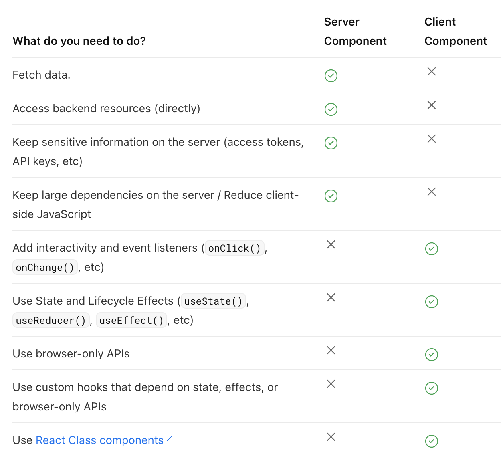

## 改版原因分析:
[[Daily/2023/2023-03-20|2023-03-20]]

## 畫面

- [Zepilin 列表](https://app.zeplin.io/project/576287bda89e8aa7045cfba5/screen/645db4a95b9d821337078288)
- [Zeplin 內頁](https://app.zeplin.io/project/576287bda89e8aa7045cfba5/screen/6451d7ffb5da8d26449e90da)

## 目錄結構

```
- workspace
	- apps/
		- fe-news
	- libs/
		- fe-common-ui
		- fe-common-utils
```

## Monorepo

- 建立 workspace: [create-nx-workspace](https://nx.dev/packages/nx/documents/create-nx-workspace)

```sh
npx create-nx-workspace@latest
--preset=next
--packageManager=pnpm
```

- 目錄結構

```
- workspace
	- apps
	- libs
	- tools
```

- 新增專案到 apps

  - @nx/next:app (使用 nextjs 模板)

  ```sh
  pnpm nx g @nx/next:app fe-news
  ```

- 新增專案到 libs (使用@nx/react:lib 模板建立 fe-common-ui)

  - https://nx.dev/packages/react/generators/library

  ```sh
  pnpm nx g @nx/react:lib fe-common-ui
  ```

- 新增元件模板到 fe-news 專案下

  ```sh
  pnpm nx g @nx/react:component header --project=fe-news
  ```

  - 會使用@nx/react:component 模板生成程式碼
    (不太放心他會加什麼可以加--dry-run，不會真的加，但會告訴你這個指令會新增什麼檔案)

    ```
    >  NX  Generating @nx/react:component
    ✔ Which stylesheet format would you like to use? · none
    ✔ Should this component be exported in the project? (y/N) · false
    CREATE apps/fe-news/app/header/header.spec.tsx
    CREATE apps/fe-news/app/header/header.tsx
    NOTE: The "dryRun" flag means no changes were made.
    ```

- 新增元件到 fe-common-ui 下

  ```sh
  pnpm nx g @nx/react:component section --project=fe-common-ui
  ```

- 刪除專案

  ```sh
  pnpm nx g rm fe-news-e2e
  pnpm nx g rm fe-news
  ```

- 重新命名專案

  ```sh
  pnpm nx g mv --project <old-name> <new-name>
  ```

- 執行專案
  ```sh
  pnpm nx serve fe-news
  # 預設跑在port 4200，可到專案下的project.json修改
  # project.json會紀錄每個專案可用的指令，類似package.json
  ```
- 執行多個專案

  ```sh
  pnpm nx run-many -t start -p fe-news fe-common-ui
  # -t (target)
  # -p (project)
  ```
  
*  Reference: 
  - [Package-Based Monorepo | Nx](https://nx.dev/tutorials/package-based-repo-tutorial)
  - [Pnpm and Nx monorepo. Part 1 | Javier Brea](https://www.javierbrea.com/blog/pnpm-nx-monorepo-01/)
  - [Create a Shared React Library in an Nx Workspace | egghead.io](https://egghead.io/lessons/react-create-a-shared-react-library-in-an-nx-workspace)
    - 新增一個 ui library

 
## CSS Library(Linaria)
- [callstack/linaria: Zero-runtime CSS in JS library](https://github.com/callstack/linaria)

  ```sh
  pnpm install next-with-linaria @linaria/babel-preset @linaria/core @linaria/react
  ```

- [next-with-linaria](https://github.com/dlehmhus/next-with-linaria)
  next13 需要額外裝 next-with-linaria，但這個專案沒有更新了，有點疑慮。

  ```ts
  // next.config.ts
  const withLinaria = require('next-with-linaria');
  const plugins = [withNx, withLinaria];
  ```

- linaria 基本語法

  ```ts
  import { styled } from 'linaria/react';
  import { css } from 'linaria';

  const Title = styled.h1`
    font-size: 36px;
  `;
  ```

  ```html
  <span
    className={css`
    color: red;
    `}
  >
    Hello there
  </span>
  ```
### Reference
- Linaria
  - [Airbnb’s Trip to Linaria](https://medium.com/airbnb-engineering/airbnbs-trip-to-linaria-dc169230bd12)

## 開發

- 可執行的指令定義在 project.json
- dev

  - 新聞列表 API CORS 問題要加(--hostname=0.0.0.0) → `dev.beta.cnyes.cool`

  ```sh
  pnpm nx serve fe-news --hostname=0.0.0.0
  ```

## Next13

- SSR
  - [Data Fetching: Fetching | Next.js](https://nextjs.org/docs/app/building-your-application/data-fetching/fetching)
- [When to use Server and Client Components?](https://nextjs.org/docs/getting-started/react-essentials#when-to-use-server-and-client-components)
  - 什麼時候用 Server Side 什麼時候用 Client Side
    

## Lint

- 使用 airbnb lint

  - [eslint-config-airbnb-typescript - npm](https://www.npmjs.com/package/eslint-config-airbnb-typescript)
    - 修改`.eslintrc.json`

## Infinite-loader

- [example](https://codesandbox.io/s/react-virtualized-infiniteloader-p7w36?file=/src/App.js)
- [Prefetching infinite queries · TanStack/query · Discussion #826](https://github.com/TanStack/query/discussions/826)

## fe-common-ui

- 安裝 storybook

  - https://nx.dev/packages/storybook

  ```sh
  pnpm nx g @nx/storybook:configuration fe-common-ui --uiFramework=@storybook/react-vite  --tsConfiguration=true
  ```

- 在 fe-common-ui 下新增樣板

  ```
  pnpm nx g @nx/react:component button --project=fe-common-ui
  ```

- 幫所有 components 新增 stories

  ```
  pnpm nx g @nx/react:stories --project=fe-common-ui
  ```

## fe-common-utils

```
- libs
	- fe-common-utils
      - time
      - html
```

- ErrorHandler
  - [Handling errors like a pro in TypeScript | by Kolby Sisk | Udacity Eng & Data](https://engineering.udacity.com/handling-errors-like-a-pro-in-typescript-d7a314ad4991)

## 其他

- 打開全部專案關係圖

  ```sh
  pnpm nx graph
  ```

## Docker 
* 產生專案Dockerfile
```sh
 pnpm nx g @nx-tools/nx-container:init fe-news  
```

* 刪除名稱是none的images
```sh
docker images -a | grep none | awk '{ print $3; }' | xargs docker rmi -f
```
* 測試docker image
```sh
docker run -d cnyes-base watch "date >> /var/log/date.log"
```
* 推版到git registry
```sh
docker build -t gitlab.cnyes.cool:5000/anue/frontend/fe-cnyes .
docker push gitlab.cnyes.cool:5000/anue/frontend/fe-cnyes
```

* local測試deploy到gitlab
```sh
docker login # 輸入信箱密碼

docker build -f apps/fe-news/Dockerfile -t gitlab.cnyes.cool:5000/anue/frontend/fe-cnyes/fe-news .
```

## tmp
* page cache
* memcached
* ISR
	* 硬碟使用量問題
	* 新聞更新頻率問題，舊新聞會存嗎？

